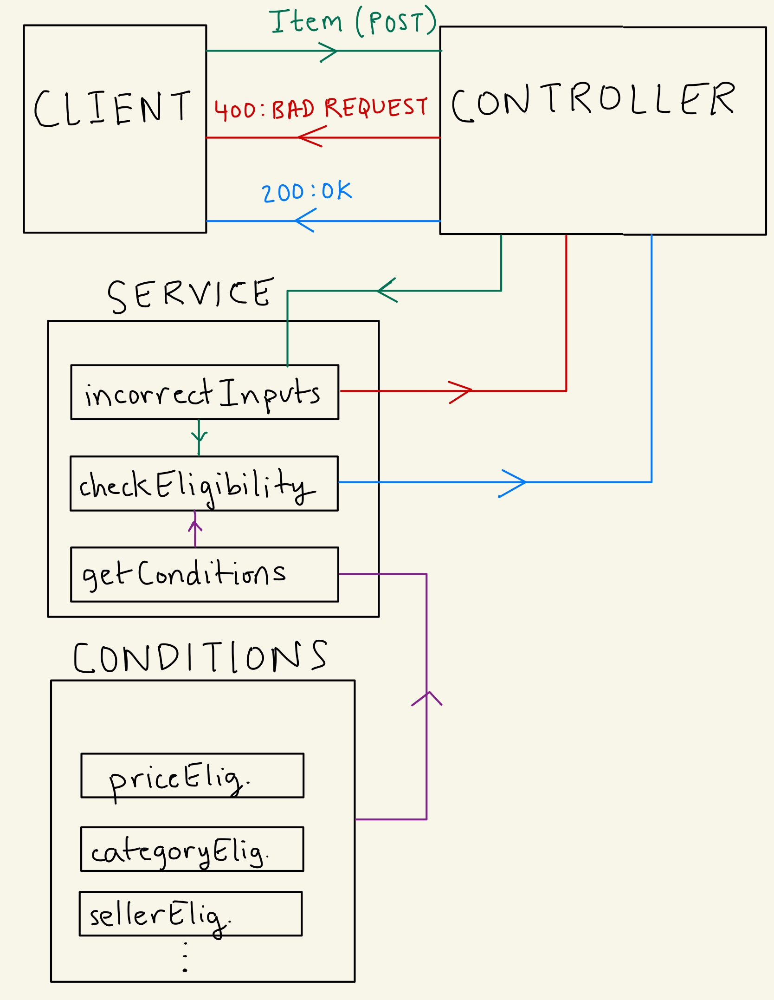
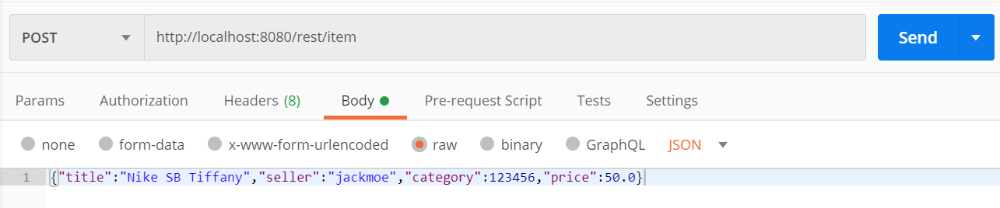
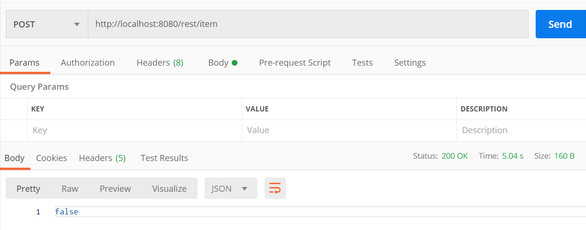
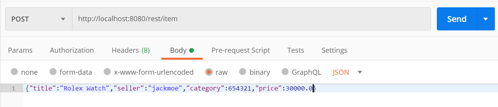
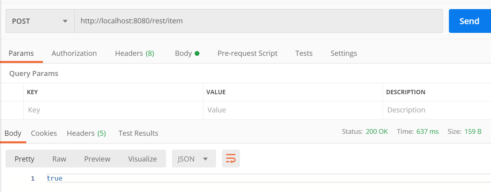
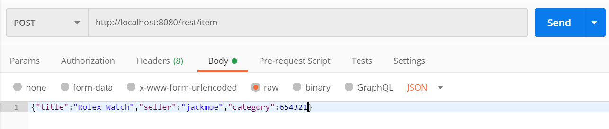
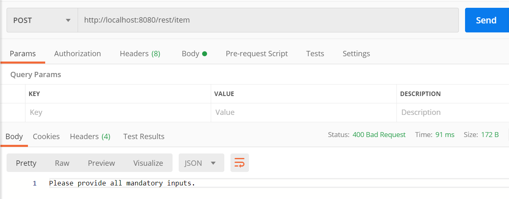

# eBay-Project
Service API for eBay's new shipping program. This project creates a RESTful web application to determine whether clients' items are eligible for the program.

## Getting Started

Follow these instructions to get the project up and running on your local machine for development and testing purposes.

### Prerequisites

You will need [JDK 14](https://www.oracle.com/java/technologies/javase-jdk14-downloads.html) installed, and your PATH environment variable should have the 'bin' folder from JDK added:

```
C:\>setx PATH "C:\Program Files\Java\jdk-14.0.1\bin;%PATH%"
```

Also, make sure you have added JAVA_HOME as an environment variable:

```
C:\>setx -m JAVA_HOME "C:\Program Files\Java\jdk-14.0.1"
```

**NOTE**: This project uses Maven as its build tool, but since the Spring Boot framework included Maven Wrapper, an executable shell script, there is no need to install Maven. The command ```mvnw``` is used to run the build tool.

### Installing

We can run any of [Maven's phases](http://maven.apache.org/guides/introduction/introduction-to-the-lifecycle.html) by going to the project's directory:

```
C:\...\eBay_project\CodingChallenge>
```

and executing a goal: 

```
mvnw clean package
```

This will compile, run tests, and package the project up into an executable JAR file. The file can be found in the *target* directory. If you want to install the JAR file to your local machine, run the *install* goal:

```
mvnw clean install
```

which will run all previous Maven goals, and save a copy of the JAR executable to the *./m2/repository* directory in your home directory.

To get the service up and running, either execute the JAR file:

```
java -jar target/CodingChallenge-0.0.1-SNAPSHOT.jar
```

or run it using ```spring-boot```

```
mvnw spring-boot:run
```

which will establish a connection to the server at port 8080. Since the application path is "/rest" and the REST endpoint's path is "/item", we can reach the endpoint using this URI: http://localhost:8080/rest/item.

## Description

Items are characterized by 4 fields:
* The *title* of the item
* The username of the *seller*
* The item's *category*
* The *price* of the item in USD

An item is eligible for the shipping program if:
* The seller of the item is enrolled in the shipping program
* The item is from a pre-approved category
* The item at least a certain price

By default, the minimum price has been set to 100 USD, and a list of pre-approved categories and enrolled sellers have been created to search through. You can find these files in the *service/conditions/* directory.

## API Documentation

 **NOTE**: If you are not interested in how the service works, and merely want to use the service, you can skip this section.
 
 Here is a flow chart that shows how the client and server communicate:
 
 
 
 
 The client sends an HTTP POST request as a JSON application to the URI mentioned, which contains the path extension to the REST endpoint in the *controller* class (found in the *controller/* directory). The method is called, and it tries to consume the request sent as an *Item* (The Item class is defined in the *model/* directory).
 
 The *CheckService* class in the *service/* directory contains 3 static methods:
 
 Type | Name | Description
:---: | :---: | ---
boolean | incorrectInputs(Item item) | Checks whether the item's fields are all non-null.
boolean | checkEligibility(Item item) | Checks if the item is eligible for the program.
List<Condition> | getConditions() | Returns the conditions for eligibility as a list.
 
 The item is first passed into the *incorrentInputs* function to both check whether the client's request was converted successfully, and whether the client provided all the fields necessary. If not, the controller sends an **HTTP:400 (BAD REQUEST)** response back to the client. Otherwise, *checkEligibility* is called, which checks if the client's item passes each condition. The controller then sends this flag along with an **HTTP:200 (OK)** response back.
 
 *Condition* is an interface found in the *service/* directory. It only has one function declaration: `boolean check(Item item)`. Every condition that the item must pass is defined as its own class (stored in the *service/conditions/* directory) and implements this interface. So far, we have 3 classes, each having their own definition of the *check* method:
 
 Class | *check* description
:---: | ---
CategoryEligibility | Checks whether the item's category is in a list of approved categories (*ItemCategories.JSON*).
PriceEligibility | Checks if the item's price is at least a certain amount.
SellerEligibility | Checks whether the seller is in a list of enrolled sellers (*EnrolledSellers.JSON*).
 
This way, adding another condition is an easy, 2-step process:

1. Write a class that implements the *Condition* interface, defining the *check* method however you would like. Make sure to add it to the *conditions* folder!
2. Add it to the *getConditions* method in *CheckService*.

Modifying the current conditions will only involve modifying the *.JSON* files, or simply changing the *PRICE_THRESHOLD* constant defined in *PriceEligibility*.

## Usage & Testing

Once the service API is up and running, you can use it to see how it works.

### Manual Tests

We can send an item in Postman using the POST HTTP request to the correct URI. Make sure the request is sent as a JSON application:



and look at the response:



Make sure to provide all of the correct fields. You can input the fields in any order, and provide more inputs than necessary.





Example of a test Item that is missing a field:





### Test Programs

A total of **7** tests are provided in the *test* directory. You can run all tests together:

```
mvnw clean test
```

or a set of them by class name:

```
mvnw clean test -Dtest=ClassName
```

#### ConditionsTest

This class is found in the *test/service/conditions/* directory. It contains **3** tests, one for each condition. Each test checks whether the condition responds appropriately to a passing item and a failing one, for a total of 6 *assert* statements. For example, the *check* method of the *PriceEligibility* condition is called twice: once with an item with too low of a price, and another with an item with a high enough price.

#### CheckServiceTest

This class is found in the *test/service/* directory. It contains **2** tests, one for the *incorrentInputs* method, and the other for the *checkEligibility* method in the *CheckService* class. The *incorrentInputs* method is treated similarly to the conditions tests: it is called twice, once with an item that contains all fields, and the other with an incomplete item.

The *checkEligibility* method is tested by filling a *JSON* file (*TestItemsCheckService.JSON*) with a handful of items. These items' eligibilities are already known, so the flag returned by the method is compared to the known value with *assert* statements.

#### ClientControllerTest

This class is found in the *test/controller/* directory. It contains **1** integration test that sends "mock" HTTP POST requests with items from *TestItemsController.JSON* to the controller. It then checks if the HTTP response was 200, if the response was a JSON application, and if the item's eligibility was correct.

#### CodingChallengeApplicationTest

This does **1** check test to check if the Spring application context started correctly.

## Next Steps

* *JSON* files were used to store pre-approved categories and enrolled sellers. In reality, there will be a database on another server that stores thousands of categories and sellers. This service would have to query that data.
* To find a category or seller match, I iterated through the list. For a long list, a search algorithm should be implemented to speed up the search.
* Adding a new condition should only take 1-step: implementing it and adding it to the conditions folder. I, however, was unable to find a way to loop through and instantiate all classes in a folder. So, this needed to be done manually in the *getConditions* method.

## Built With

* [Spring Boot](https://spring.io/projects/spring-boot) - The web framework used
* [Maven](https://maven.apache.org/) - Dependency Management, build tool
* [Jersey](https://eclipse-ee4j.github.io/jersey/) - starter, tests

### Maven Dependencies


## Authors

* **Theo Pendle** - *Jersey API setup*
* **Kunal Lakhanpal** - *Implementation of eBay's shipping program service*

## Acknowledgments

* I have used a [Jersey API tutorial](https://medium.com/@theopendle/creating-a-jersey-api-with-spring-boot-87a1af0512e5) by Theo Pendle that helped me setup a basic REST API service using Spring Boot.
* Thank you to Vinit Parikh and Brian Mak for helping me with the project.
* Thank you to the eBay team for this opportunity!

